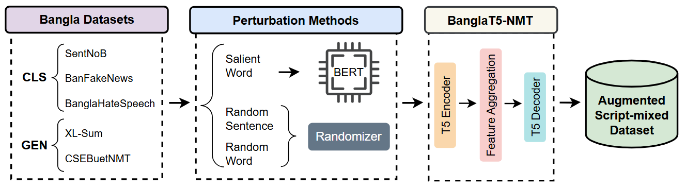

# Robustness of LLMs to Transliteration Perturbations in Bangla

  <strong>Fabiha Haider*</strong>
    ·
    <strong>Md Farhan Ishmam*</strong>
    ·
    <strong>Fariha Tanjim Shifat</strong>
    ·
    <strong>Md Tasmim Rahman</strong>
    ·
    <strong>Md Fahim</strong>
    ·
    <strong>Md Farhad Alam Bhuiyan</strong>

---

We present the first study evaluating the robustness of Large Language Models and Bangla language models under transliteration-based textual perturbations. By augmenting Bangla datasets with script-mixed text that combines native Bangla and Romanized transliterations, we emulate both realistic and adversarial scenarios. Our experiments reveal significant vulnerabilities in current models, with discriminative models showing higher susceptibility than generative models, highlighting critical gaps for real-world deployment.

## Overview

Our framework applies three types of transliteration-based perturbations to evaluate model robustness:
- **Random Word Perturbation**: Randomly replaces words with transliterations.
- **Random Sentence Perturbation**: Randomly replaces entire sentences with transliterations.
- **Salient Word Perturbation**: Targets the most salient words identified via attention scores.

## Key Findings

- **Random sentence** and **salient word** perturbations cause larger performance drops than random word perturbations.
- Smaller language models (BanglaBERT, BanglaT5) show higher vulnerability with F1-score drops up to **60%**.
- LLMs (GPT-4o, Claude-3.5 Sonnet, Qwen-2.5, Llama-3) show better robustness but still experience **3-19%** degradation.
- Tokenization bottlenecks significantly impact cross-script processing capabilities.
